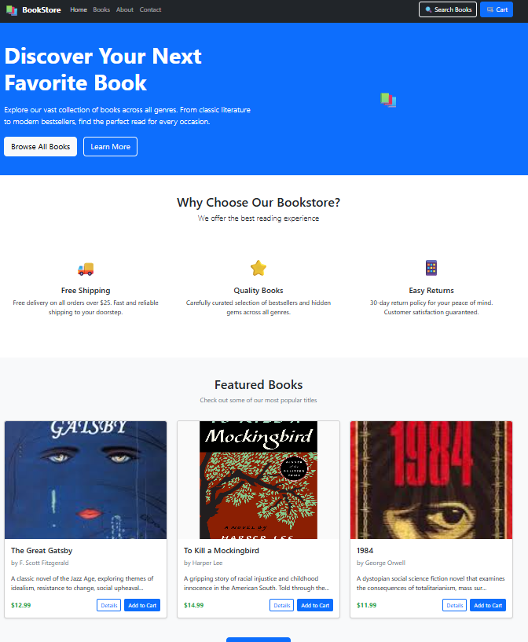

# 📚 Online Bookstore - React Application

A modern, responsive online bookstore built with React.js featuring a complete book browsing and shopping experience.



## 🚀 Project Overview

This is a frontend React application for an online bookstore that allows users to browse, search, and explore books across various genres. The application features a clean, responsive design that works seamlessly on both desktop and mobile devices.

### ✨ Features

- **📖 Book Catalog**: Browse 6+ books across multiple genres
- **🔍 Search & Filter**: Find books by title, author, or category
- **📱 Responsive Design**: Optimized for desktop, tablet, and mobile
- **🛒 Shopping Cart**: Add books to cart with real-time updates
- **📄 Multiple Pages**: Home, Books, About, Contact, and Book Details
- **🎨 Modern UI**: Built with Bootstrap and custom CSS
- **📞 Contact Integration**: Direct contact links and Google Maps location

## 🛠️ Technologies Used

- **Frontend**: React 18.2.0
- **Routing**: React Router DOM 6.8.0
- **Styling**: Bootstrap 5.2.3 + Custom CSS
- **Icons**: Emoji icons for cross-platform compatibility
- **Version Control**: Git & GitHub

## 📋 Prerequisites

Before running this project, make sure you have the following installed:

- Node.js (version 14 or higher)
- npm or yarn package manager
- Git for version control

## ⚡ Setup Instructions

### 1. Clone the Repository

```bash
git clone https://github.com/yourusername/online-bookstore.git
cd online-bookstore